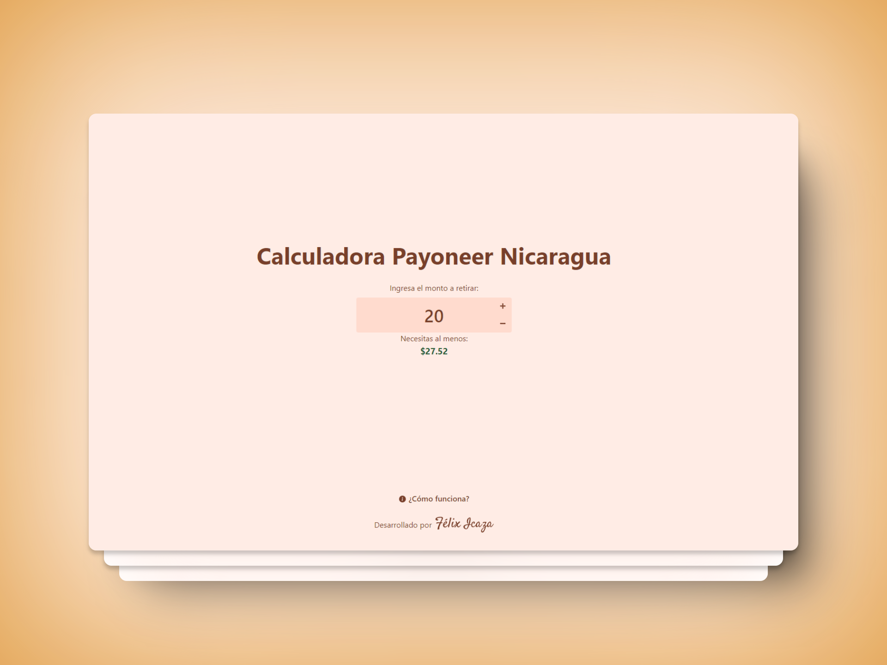

<div align="center">
  <a href="https://payoneer-calculator.web.app/" target="_blank">
    
  </a>
  <h1>Calculadora Payoneer Nicaragua</h1>
  <p>Calcula de manera FÁCIL, RÁPIDA Y SEGURA, todas las COMISIONES DE PAYONEER Y DEL BANCO aplicadas al momento de realizar un retiro de un CAJERO ATM en Nicaragua.</p>
</div>

<div align="center">
  <a href="https://payoneer-calculator.web.app/" target="_blank">
    Sitio web
  </a>
  <span>&nbsp;⁘&nbsp;</span>
  <a href="https://github.com/felixicaza/payoneer-calculator?tab=readme-ov-file#-stack">
    Stack
  </a>
  <span>&nbsp;⁘&nbsp;</span>
  <a href="https://github.com/felixicaza/payoneer-calculator?tab=readme-ov-file#-contribuir">
    Contribuir
  </a>
  <span>&nbsp;⁘&nbsp;</span>
  <a href="https://felixicaza.com" target="_blank">
    Felix Icaza
  </a>
</div>

</p>

<div align="center">

[](https://actions-badge.atrox.dev/felixicaza/payoneer-calculator/goto?ref=main)


</div>

## 📦 Stack

- [**Astro**](https://astro.build/) - El framework web para sitios web basados en contenidos.
- [**Typescript**](https://www.typescriptlang.org/) - JavaScript con sintaxis para tipos.
- [**React**](https://react.dev/) - La biblioteca para interfaces de usuario web y nativas.
- [**Tailwindcss**](https://tailwindcss.com/) - Un marco de trabajo CSS que prioriza las utilidades para crear rápidamente diseños personalizados.
- [**@vite-pwa/astro**](https://tailwindcss.com/) - Integración de PWA de configuración cero para Astro.
- [**Firebase**](https://firebase.google.com/?hl=es) - Plataforma de desarrollo de aplicaciones web y móviles de Google.

## 🚀 Contribuir

1. Haz un [Fork](https://github.com/felixicaza/payoneer-calculator/fork) del respositorio.

2. Instala las dependencias:

```bash
pnpm install
```

3. Ejecutar el servidor de desarrollo:

```bash
pnpm dev
```

Abre [http://localhost:4321](http://localhost:4321), haz tus cambios y realiza una PR. ✨

## 📄 Licencia

Este proyecto utiliza la Licencia MIT. Consulte el [Archivo de Licencia](LICENSE) para obtener más información.
